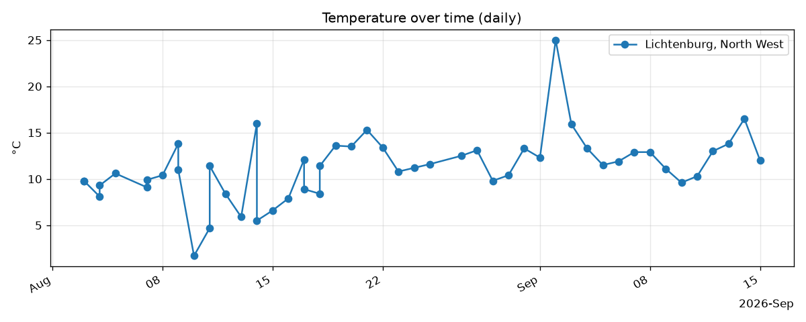
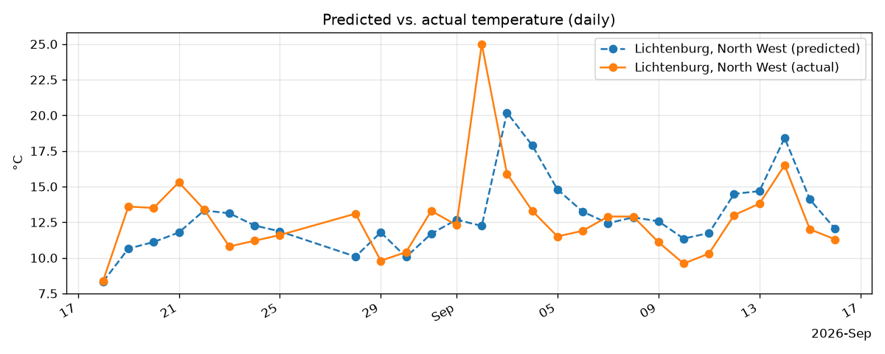

# Daily Weather Logger

An automated data pipeline that collects daily weather statistics from a
public API, logs them over time, and generates a next-day temperature
forecast using a self-scoring machine learning model — all running
entirely on GitHub Actions with no external server or database.


## Overview

The pipeline runs on a daily schedule and performs four steps:

1. **Collect** — fetch current and daily weather statistics from the
   [Open-Meteo](https://open-meteo.com/) API (no authentication required).
2. **Forecast** — train a scikit-learn regression model on the accumulated
   history and predict the next day's temperature.
3. **Evaluate** — score the previous day's prediction against the actual
   outcome, building a running accuracy log.
4. **Publish** — regenerate summary charts and commit the updated data
   back to the repository.

No server, database, or manual intervention is required — the entire
pipeline runs on GitHub's hosted infrastructure via a scheduled Actions
workflow.

## Architecture

```
GitHub Actions (scheduled, daily)
        │
        ▼
weather_logger.py        → Open-Meteo API
        │
        ▼
data/weather_history.csv
        │
        ▼
predict_temperature.py   → scores prior prediction, trains model, forecasts next day
        │
        ▼
data/predictions.csv
        │
        ▼
generate_chart.py        → chart.png, predictions.png
        │
        ▼
Commit + push
```

## Features

- **Zero-infrastructure automation** — scheduled via GitHub Actions using
  the built-in `GITHUB_TOKEN`; no secrets, servers, or third-party hosting.
- **Historical logging** — structured CSV data, one row appended per day.
- **Self-scoring forecast model** — a lightweight regression model using
  seasonal (day-of-year) and lag-based features, retrained daily on the
  growing dataset; accuracy (mean absolute error) is tracked over time.
- **Automatic visualization** — trend and prediction-accuracy charts are
  regenerated and committed on every run.

## Temperature trend



## Forecast accuracy



The model requires a minimum of 10 days of logged history before
generating its first forecast. Mean absolute error is printed on each
run and is expected to improve as the training set grows.

## Data schema

`data/weather_history.csv`:

| Field | Description |
|---|---|
| `temperature_c` | Current temperature |
| `feels_like_c` | Apparent temperature |
| `humidity_pct` | Relative humidity |
| `wind_speed_kmh` | Wind speed |
| `precipitation_mm` | Precipitation |
| `day_min_c` / `day_max_c` | Forecast daily min/max |
| `conditions` | Weather description |

`data/predictions.csv`:

| Field | Description |
|---|---|
| `predicted_temp_c` | Forecast temperature for the target date |
| `actual_temp_c` | Logged temperature once available |
| `abs_error_c` | Absolute error between forecast and actual |

## Setup

```bash
git clone https://github.com/<username>/<repo>.git
cd <repo>
pip install -r requirements.txt
python weather_logger.py
python predict_temperature.py
python generate_chart.py
```

Locations to track are configured in the `LOCATIONS` dictionary at the
top of `weather_logger.py`.

## Deployment

The workflow defined in `.github/workflows/daily-weather.yml` runs on a
daily cron schedule and can also be triggered manually from the Actions
tab. It requires no configuration beyond enabling **read and write
permissions** for the repository under
**Settings → Actions → General → Workflow permissions**.

## Tech stack

Python · Requests · Pandas · Matplotlib · scikit-learn · GitHub Actions · Open-Meteo API

## License

MIT
